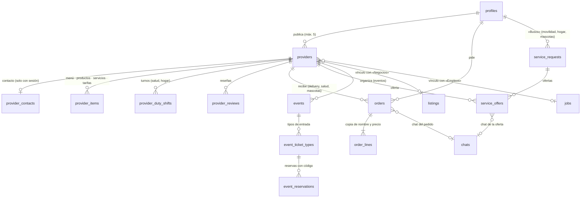

# Directorios colaborativos de conectari.com

Diseño técnico de las seis secciones nuevas de alta frecuencia: **Movilidad (taxis y mandados), Delivery, Farmacias y salud, Eventos y entradas, Mascotas y Servicios del hogar**.

> **Estado.** **Fases 0 (base de datos), 1 (interfaz) y 2 (carrito, pedidos, solicitudes y ofertas) están hechas.** Están activas **las 6 secciones** (`activa: true` en `src/data/directorio.ts`): Delivery, Farmacias/Salud, Taxis y mandados, Eventos y entradas, Mascotas y Servicios del hogar. Base de datos: `update_006` a `update_009`, probadas contra PostgreSQL real (76 pruebas en `supabase/tests/directorios.test.mjs`). Interfaz: hub, listados con filtros, fichas, buscador universal, alta guiada y panel «Mi negocio» (lógica probada en `supabase/tests/directorio-ui.test.mjs`, 68 pruebas). **Fase 2:** carrito, pago, «Mis pedidos», bandeja del negocio y seguimiento en tiempo real (ver §4.6), solicitudes con ofertas para Taxis, Hogar y Mascotas (ver §4.7) y **Eventos y entradas** (ver §4.8).

---

## 1. Principios

| Principio | Cómo se traduce |
|---|---|
| **Un núcleo, no seis sistemas.** | Una sola tabla de perfiles (`providers`) y un solo conjunto de mecanismos (catálogo, pedidos, solicitudes, reseñas, moderación) parametrizados por *sección* (`vertical`). Añadir una categoría es una fila de catálogo; añadir una sección es una entrada en `VERTICALES`, no un módulo nuevo. |
| **Autoservicio real.** | Cualquier persona con sesión publica **sin aprobación previa**. La confianza se gana con verificación (KYC), reseñas reales y denuncias, no con un cuello de botella de moderación. |
| **El servidor manda.** | Precios, totales, aforo, estados, valoración, verificación y slug los calculan funciones `SECURITY DEFINER`. El cliente solo tiene privilegios *por columna* sobre lo que le pertenece. |
| **Integrar, no duplicar.** | Se reutilizan `profiles` (KYC, confianza), `chats`/`messages` (negociación), `notifications` (tiempo real), `wallets` (monedas), `listings` («Negocios») y `jobs` («Empleos»). |
| **Entretenimiento → negocio.** | Cada sección se conecta con un gancho de entretenimiento que ya existe (ver §6). |

## 2. Modelo de datos



### Tablas

| Tabla | Para qué | Lo esencial |
|---|---|---|
| `providers` | Perfil comercial o profesional (taxista, restaurante, farmacia, organizador, veterinaria, plomero…) | `vertical` + `subtype` validados contra `_directory_catalog()`; `slug` generado por el servidor; `channels` (local · entrega · retiro · visita · en_linea); `hours` (semanal); `lat/lng` opcionales; `status` (`active`/`paused`/`review`/`suspended`); `verified_at`, `rating`, `orders_count`, `boosted_until` solo los toca el servidor |
| `provider_contacts` | Teléfono, WhatsApp, dirección exacta | Visible **solo con sesión** (nunca para anónimos): evita el rastreo de teléfonos y empuja al registro. El chat de la app es el canal por defecto |
| `provider_items` | Menú, productos, servicios y tarifas | `kind` ∈ `menu_item` (Delivery) · `product` (Delivery, Salud, Mascotas) · `service` · `rate` (Movilidad); `requires_prescription` solo en Salud; máx. 200 por perfil |
| `provider_duty_shifts` | Farmacias de turno, guardias 24 h | Solo Salud y Hogar; máx. 48 h por turno |
| `orders`, `order_lines` | Pedidos con carrito | El cliente envía **producto y cantidad, nunca precios**. Las líneas copian nombre y precio del momento |
| `service_requests`, `service_offers` | «Busco» de servicios con ofertas de profesionales (modelo subasta inversa) | Caducan solos (1 h ahora, 12 h hoy, +2 h tras la cita); una oferta por perfil |
| `events`, `event_ticket_types`, `event_reservations`, `event_interest` | Cartelera y reserva de entradas | Aforo atómico; código por reserva; una reserva vigente por persona y tipo |
| `provider_reviews` | Reseñas | Solo con interacción real; `verified_purchase` si hubo transacción |
| `content_reports` | Denuncias | 3 personas distintas ocultan el contenido hasta que lo revise la moderación |

### Funciones (API de servidor)

| Función | Quién | Qué garantiza |
|---|---|---|
| `search_providers(vertical, subtype, zone, q, open_now, delivers, verified, on_duty, lat, lng, limit, offset)` | público | Una sola búsqueda para las seis secciones. Orden: de turno **y verificado** → impulsado → cercanía → verificado → valoración |
| `directory_counts()` | público | Cifras reales por sección (para la portada) |
| `place_order(...)` / `set_order_status(...)` | sesión | Total calculado en servidor; mínimo de pedido; **medicamentos con receta bloqueados**; máquina de estados (paridad con `transicionesPedido()`); avisos y mensaje de sistema en el chat |
| `create_service_request(...)` | sesión | Avisa a ≤ 20 profesionales de la categoría (los de la misma zona primero); en Movilidad, solo a quienes tienen **identidad verificada** |
| `send_offer(...)` / `accept_offer(...)` / `withdraw_offer(...)` / `close_service_request(...)` | sesión | En Movilidad solo ofertan perfiles con KYC; aceptar rechaza las demás y abre el chat |
| `reserve_tickets(type, qty)` | sesión | **Aforo atómico** (probado con 12 peticiones simultáneas sobre 5 plazas); no se reserva en el evento propio |
| `cancel_reservation(id)` / `check_in(code)` | persona / organizador | Devuelve el cupo · marca la entrada como usada una sola vez |
| `review_provider(id, rating, comment)` | sesión | Exige haber contactado (nivel 1) o contratado (nivel 2 = «compra verificada») |
| `report_content(type, id, reason, note)` / `moderate_content(...)` | sesión / admin | Ocultación automática a las 3 denuncias; verificar, suspender, restaurar |
| `set_provider_active(id, bool)` | dueño | Solo alterna visible ↔ pausado |

### Seguridad y privacidad (decisiones deliberadas)

- **Columnas de confianza fuera de alcance del cliente**: `status`, `verified_at`, `rating`, `orders_count`, `boosted_until`, `slug`, `owner_id` y `vertical` no tienen `UPDATE` para `authenticated`.
- **Contacto con sesión**: `provider_contacts` no es legible por anónimos y desaparece si el perfil se pausa.
- **Recetas médicas**: un artículo con `requires_prescription` no puede añadirse a un pedido; solo se consulta por chat.
- **Movilidad**: ofertar viajes/encomiendas exige identidad verificada (reutiliza el KYC existente).
- **Sin pasarela de pago en esta fase**: efectivo o transferencia coordinados por el chat; las entradas de pago se reservan y se abonan en puerta. El diseño no impide añadir una pasarela después (`orders.payment_method`, `event_reservations.total`).
- **RLS sin recursión**: las políticas de `service_requests` y `service_offers` se consultan entre sí; se rompe el ciclo con `_has_offer_on()` (definer, solo responde «¿tengo una oferta aquí?»). Lo detectó la suite de pruebas.
- **Límites anti-spam**: 5 perfiles por persona, 200 elementos por perfil, 30 eventos futuros por organizador, 5 solicitudes abiertas y 5 pedidos sin responder por persona.

### Flujos

**Pedido** (`orders.status`): `placed → accepted → preparing → on_the_way → delivered`; el negocio también puede `rejected`; la persona solo puede `cancelled` mientras esté en `placed`. Cada cambio avisa a la otra parte y deja un mensaje de sistema en el chat del pedido.

**Solicitud y ofertas** (movilidad, hogar, mascotas): la persona publica *«Del Centro al aeropuerto, hoy, máx. 8 USD»* → se avisa a los profesionales que encajan → cada uno oferta *precio + minutos* → la persona elige → se abre/continúa el chat y las demás ofertas se rechazan. Es el mismo patrón para un viaje, una encomienda, una fuga de agua o un paseador.

**Evento y entrada**: el organizador publica el evento y sus tipos de entrada → la persona reserva (`reserve_tickets`) y recibe un **código** → en la puerta el organizador lo valida (`check_in`).

## 3. Cómo encaja con lo que ya existe

A nivel de **base de datos todo lo de esta tabla está listo** (vínculos, chats, avisos, monedas). Los puntos que dicen «la ficha muestra…» o «ofrece…» son la parte de interfaz de las fases 1–3.

| Ya existe | Integración |
|---|---|
| **Negocios** (`listings`, categoría *business*) | `providers.listing_id` vincula el perfil de delivery con su anuncio; la ficha del anuncio puede mostrar «Pide a domicilio» |
| **Empleos / Servicios** (`jobs`) | `providers.job_id` vincula a plomeros, cerrajeros, etc. con su servicio; las solicitudes del Hogar se ven como «Busco» |
| **Busco** | `/publicar?modo=busco` ofrece «servicio» y crea un `service_request` |
| **Mensajes** | Pedidos y ofertas usan chats `direct` con clave propia (`order:<id>`, `request:<id>:<uid>`): la bandeja actual los muestra sin cambios |
| **Notificaciones** | Todos los avisos van por `notifications` (Realtime); el `AvisoVivo` de la portada los muestra |
| **Monedas y retos** | +30 🪙 al publicar el **primer perfil** (una vez). Ver ideas de retos en §6 |
| **Perfil / KYC** | `identity_verified` habilita ofertar en Movilidad y se muestra como insignia |
| **Comunidad y portada** | `directory_counts()` alimenta las tarjetas; «Top Conectores» puede contar reseñas e invitaciones de negocios |

## 4. Arquitectura Next.js

> Las rutas y componentes de 4.1–4.4 son el diseño original; la **implementación de la Fase 1** (lo que existe hoy) está resumida en 4.5.

### 4.1 Rutas

```
src/app/
├─ directorio/
│  ├─ page.tsx                        Hub: 6 secciones, «de turno ahora», solicitudes abiertas, eventos de hoy      (RSC, revalidate 60 s)
│  ├─ [vertical]/page.tsx             Listado con filtros en la URL (?subtipo=&zona=&q=&abierto=1&entrega=1…)     (RSC + islas cliente)
│  ├─ [vertical]/[slug]/page.tsx      Ficha: cabecera, menú/tarifas, horario, reseñas, contacto, botón de pedido   (RSC + islas cliente)
│  ├─ [vertical]/[slug]/pedir/page.tsx  Carrito y confirmación                                                     (cliente)
│  ├─ solicitar/[vertical]/page.tsx   Formulario «Busco» (viaje, encomienda, reparación…)                          (cliente)
│  ├─ solicitudes/page.tsx            Bandeja del profesional: solicitudes abiertas de su categoría + sus ofertas  (cliente, Realtime)
│  ├─ pedidos/page.tsx                Mis pedidos y pedidos recibidos, con cambio de estado                        (cliente, Realtime)
│  └─ mi-negocio/                     Panel del proveedor
│     ├─ page.tsx                     Mis perfiles, pedidos y ofertas pendientes
│     ├─ nuevo/page.tsx               Alta guiada por sección (asistente de 3 pasos)
│     └─ [id]/page.tsx                Editar perfil · menú · horario · turnos · eventos
└─ eventos/
   └─ [id]/page.tsx  y  [id]/puerta/page.tsx   Detalle + reserva · escáner de códigos del organizador
```

**Alias amigables** (SEO y memoria de la gente) en `next.config.ts`, sin duplicar páginas: `/taxis → /directorio/movilidad`, `/delivery → /directorio/delivery`, `/farmacias → /directorio/salud`, `/eventos → /directorio/eventos`, `/mascotas → /directorio/mascotas`, `/hogar → /directorio/hogar`. La tabla ya está en `VERTICALES[].alias`, y un test comprueba que ningún alias choca con una carpeta existente de `src/app`.

### 4.2 Renderizado y datos

- **Listados y fichas = Server Components.** Consultan con el cliente de servidor (`src/lib/supabase/server.ts`) y `search_providers()` (una sola llamada, paginada de 24 en 24). Es la parte que debe indexar Google: `generateMetadata()` por ficha y JSON-LD `LocalBusiness` / `Event`. `revalidate` corto (60 s); las fichas usan `generateStaticParams` solo para las secciones, no para cada negocio.
- **Islas cliente** solo donde hay interacción: filtros, carrito, «pedir», reservar, reseñar, denunciar, contacto (el teléfono se pide al montar y solo con sesión).
- **No cargar directorios en `SocialContext`.** Ese contexto ya descarga hasta 1000 perfiles y 500 anuncios al arrancar; los directorios crecerán mucho más. Cada pantalla pide **solo lo suyo** y pagina en servidor.
- **Realtime** solo en `pedidos`, `solicitudes` y el panel del negocio (las tablas `orders`, `service_requests`, `service_offers` y `events` ya están en la publicación).
- **Filtros en la URL** (`searchParams`): enlaces compartibles y sin estado oculto.

### 4.3 Estructura de código

```
src/data/directorio.ts            ✅ Catálogo: secciones, categorías, canales, estados, horarios, rutas (hecho, con tests de paridad con SQL)
src/lib/directorio/servidor.ts    Consultas de servidor tipadas (buscar, ficha, eventos, contadores)
src/lib/directorio/mapeo.ts       Filas de Supabase → tipos de interfaz
src/features/directorio/
   hooks.ts                       usePedidos, useSolicitudes, useMisPerfiles (Realtime + acciones RPC)
   TarjetaProveedor.tsx           Tarjeta del listado (foto, nombre, «abierto ahora», de turno, verificado, valoración, distancia)
   FiltrosDirectorio.tsx          Subcategoría, zona, texto, abierto ahora, a domicilio, verificados, de turno
   FichaProveedor.tsx             Compone las secciones según `capacidades` de la sección
   MenuProveedor.tsx              Catálogo agrupado por sección (`section`), con «añadir al carrito»
   TarifasProveedor.tsx           Tarifas de Movilidad
   HorarioSemanal.tsx             Usa `estaAbierto()` y `textoHorarioDia()`
   TurnosProveedor.tsx            «De turno hoy» (Salud, Hogar)
   ResenasProveedor.tsx           Lista + formulario (solo si puede reseñar)
   BotonContacto.tsx              Chat / WhatsApp / llamar (con sesión)
   Carrito.tsx  +  PedidoPanel.tsx  Carrito local y seguimiento de estado
   FormSolicitud.tsx              «Busco»: campos según la sección
   ListaOfertas.tsx               Ofertas recibidas + aceptar
   BandejaSolicitudes.tsx         Vista del profesional
   TarjetaEvento.tsx  +  ReservaEntradas.tsx  +  Puerta.tsx   Cartelera, reserva y validación de códigos
   AsistenteAlta.tsx              Alta guiada por sección
   BotonDenunciar.tsx             Denuncia con razón (`RAZONES_DENUNCIA`)
```

**La interfaz se genera a partir de la configuración.** `FichaProveedor` decide qué mostrar leyendo `VERTICAL_POR_ID[vertical].capacidades` (`pedidos`, `solicitudes`, `catalogo`, `turnos`, `eventos`). Por eso las seis secciones comparten componentes y una sección nueva no requiere páginas nuevas.

### 4.4 Qué pantalla usa qué

| Pantalla | Datos |
|---|---|
| Hub | `directory_counts()`, `search_providers(p_on_duty => true)`, eventos próximos, `service_requests` abiertas |
| Listado | `search_providers(...)` |
| Ficha | `providers` por `slug`, `provider_items`, `provider_duty_shifts`, `provider_reviews`, `provider_contacts` (con sesión) |
| Pedido | `place_order()`; seguimiento con Realtime sobre `orders` |
| «Busco» | `create_service_request()`; ofertas con Realtime sobre `service_offers` |
| Bandeja del profesional | `service_requests` abiertas + `send_offer()` |
| Evento | `events` + `event_ticket_types` → `reserve_tickets()`; puerta → `check_in()` |

### 4.5 Fase 1: lo que existe hoy

**Rutas** (`src/app/directorio/`)

| Ruta | Render | Qué hace |
|---|---|---|
| `/directorio` | RSC, ISR 60 s | Hub: buscador universal, secciones con cifras reales, farmacias de turno ahora, abiertos ahora, invitación a registrarse |
| `/directorio/[vertical]` | RSC dinámico | Listado con filtros **en la URL** (categoría, texto, zona, abierto ahora, a domicilio, verificados, de turno) y paginación. Con filtros o página > 1 lleva `noindex`. Las secciones inactivas muestran «Muy pronto» |
| `/directorio/[vertical]/[slug]` | RSC, ISR 60 s | Ficha: carta o productos agrupados, horario con el día de hoy, turnos, reseñas, datos estructurados (JSON-LD) y metadatos. El contacto, la reseña y la denuncia son islas de cliente |
| `/directorio/buscar` | RSC dinámico, `noindex` | Resultados del **buscador universal**: negocios y productos/platos con su precio |
| `/directorio/mi-negocio` | cliente, exige sesión | Panel: mis negocios, estado, medidor de completitud, pausar/publicar |
| `/directorio/mi-negocio/nuevo` | cliente, exige sesión | **Alta guiada** en 6 pasos |
| `/directorio/mi-negocio/[id]` | cliente, exige sesión | Editor: datos y fotos, contacto, horario, catálogo, turnos (farmacias), visibilidad, eliminar |
| `/farmacias`, `/delivery` (y los alias de las otras secciones) | rewrite | Alias amigables definidos en `next.config.ts` (un test comprueba que coinciden con el catálogo) |

**Alta guiada** (`features/directorio/alta/`): 1 Tipo → 2 Tu negocio → 3 Contacto → 4 Horario → 5 Fotos → 6 Catálogo (con vista previa de la tarjeta). Cada paso se valida antes de avanzar; el borrador se guarda en el dispositivo (sin las imágenes) y sobrevive a cerrar la pestaña; la plantilla de la sección propone canales, horario, secciones y ejemplos de catálogo; al publicar se suben las imágenes, se crea el perfil, el contacto y el catálogo, y se muestra la ficha con su enlace para compartir por WhatsApp y las monedas ganadas. Si el contacto o el catálogo fallan, el negocio ya queda publicado y se avisa qué completar.

**Buscador universal.** `search_directory(q, zona, sección)` (actualización 007) encuentra **negocios y lo que venden**: «paracetamol» lista las farmacias que lo tienen y a qué precio; «ceviche», los restaurantes con ese plato. No distingue acentos ni mayúsculas, escapa los comodines de `LIKE` (un `%` se busca literalmente), pide 2 letras como mínimo y usa índices trigram. Se integra en tres sitios: la **portada** (pestañas Inmuebles · Comida · Farmacias · Todo), el hub y `/directorio/buscar`. Los formularios son `GET`: funcionan sin JavaScript y el resultado es un enlace compartible. `search_providers` (listados) usa la misma comparación de texto.

**Cómo se activa otra sección.** Cambiar `activa: false` a `true` en su entrada de `VERTICALES`. El hub, el listado, la ficha, el alta y el buscador ya funcionan para cualquier sección; lo que sigue faltando son sus flujos transaccionales (Fase 2 y 3).

**Decisiones de seguridad en la interfaz**
- Consultas de servidor con la clave pública **sin sesión**: solo se muestra lo público. El contacto se pide en el navegador y solo lo devuelve la base de datos a personas con sesión.
- Los datos estructurados **no incluyen teléfono ni dirección exacta**; se serializan escapando `<` para que ningún nombre pueda cerrar el `<script>` (con test).
- La reseña muestra solo el nombre de pila; el contenido de personas se renderiza como texto (React lo escapa).
- Medicamentos con receta: se muestran como información con la etiqueta «℞ Con receta médica» y un aviso; no se pueden pedir.
- `/directorio/mi-negocio/*` está en la lista de rutas protegidas del middleware.

**Un hallazgo de las pruebas** que conviene recordar: un índice sobre una función (`public._norm(name)`) se mantiene con los privilegios de **quien inserta**, así que esa función debe ser ejecutable por `authenticated`; sin eso publicar un perfil fallaba con «permission denied for function _norm».

### 4.6 Fase 2: carrito y pedidos (Delivery y Farmacias)

**Flujo.** Ficha → «+ Agregar» (solo productos disponibles, con precio fijo y sin receta) → barra flotante «🛒 3 · $12.50» → `/directorio/carrito` → `place_order()` → `/directorio/pedidos/<id>` → chat del pedido, seguimiento y reseña.

| Ruta | Quién | Qué hace |
|---|---|---|
| `/directorio/carrito` | cualquiera (pagar exige sesión; el carrito se conserva al iniciar sesión) | contrasta el carrito con el catálogo actual, elige domicilio o retiro, dirección, teléfono, notas y pago |
| `/directorio/pedidos` | cliente | «En curso» y «Anteriores», cancelar mientras nadie responda |
| `/directorio/pedidos/[id]` | cliente o dueño del negocio | línea de tiempo, productos, datos de entrega, chat, acciones según el rol, «Repetir pedido» y reseña |
| `/directorio/mi-negocio/pedidos` | dueño | bandeja Nuevos · En curso · Finalizados con aceptar/rechazar y avanzar de estado |

**Decisiones.**
- **El precio lo fija el servidor.** El navegador solo envía `item_id` y cantidad; `place_order()` calcula subtotal, envío y total con los precios vigentes. El total del carrito es una estimación, y una prueba compara ambos cálculos (4 carritos × domicilio/retiro, con decimales como 19.99 o 0.10) para que no diverjan.
- **Un carrito = un negocio**, como en las apps de reparto. Agregar algo de otro negocio pregunta antes de vaciar el carrito. Vive en `localStorage` (sirve sin sesión), se comparte entre pestañas y caduca a los 7 días.
- **Se reconcilia antes de pagar** (`reconciliar`): quita lo agotado, con receta o sin precio, actualiza precios y avisa de cada cambio; bloquea si el negocio se pausó o ya no entrega.
- **Máquina de estados única** (`transicionesPedido` en TypeScript = `set_order_status` en SQL, con prueba de paridad): enviado → aceptado → preparando → en camino/listo para retirar → entregado, más rechazado y cancelado. La interfaz solo ofrece transiciones posibles.
- **Sin respuesta en 3 horas, el pedido se cancela solo** (`expire_stale_orders()`, que se ejecuta al abrir la bandeja o el detalle) y se avisa en el chat. Máximo de pedidos sin responder por persona para evitar spam.
- **Privacidad:** el negocio ve el nombre de pila, el teléfono y la dirección **solo de quienes le pidieron**; RLS limita cada pedido al cliente y al dueño.
- **Tiempo real:** `orders` está en la publicación realtime; las listas y el detalle se recargan al cambiar.
- **Pago:** efectivo o transferencia coordinada por chat. No hay pasarela de pago todavía.

**Pendiente:** cupones con monedas y pasarela de pago.

### 4.7 Fase 2: solicitudes y ofertas (Taxis, Hogar y Mascotas)

**Flujo.** «Pedir ofertas» (`/directorio/solicitudes/nueva`) → se avisa a los profesionales de la categoría (máx. 20, los de la misma zona primero) → cada uno envía **precio y tiempo** con uno de sus perfiles → quien pidió compara, acepta una y **coordinan por el chat** que se abre con la primera oferta → reseña en la ficha del profesional.

| Ruta | Quién | Qué hace |
|---|---|---|
| `/directorio/solicitudes` | cualquiera con sesión | pestañas «Mis solicitudes» (con ofertas para revisar) y «Para mi negocio» (lo que piden en tu categoría, con insignia de pendientes) |
| `/directorio/solicitudes/nueva` | cualquiera con sesión | formulario con categoría, zona (y destino en viajes), cuándo, presupuesto y detalles según la categoría |
| `/directorio/solicitudes/[id]` | solicitante o profesional | el solicitante ve las ofertas (más barata y más rápida marcadas), acepta o cierra; el profesional ofrece, cambia o retira la suya |

**Decisiones.**
- **Las reglas viven en el servidor** (`create_service_request`, `send_offer`, `accept_offer`…); el navegador las repite para avisar antes (`validarSolicitud`, `validarOferta`) y dos pruebas de paridad contra PostgreSQL comprueban que lo que el cliente da por bueno el servidor no lo rechaza.
- **Caducidad por momento:** «ahora» 1 h, «hoy» 12 h, «otro día» hasta 2 h después de la hora elegida (máx. 90 días). Una abierta con la hora vencida se muestra como «Caducada» aunque la base no haya cambiado su estado. Máximo 5 solicitudes abiertas por persona.
- **Detalles con lista blanca:** solo se envían campos conocidos con valores válidos (pasajeros, tamaño del envío, urgencia, tipo de mascota); nunca texto libre en `details`.
- **Privacidad:** la solicitud solo lleva la **zona**; la dirección exacta se da por chat tras elegir. Cada profesional solo ve **su** oferta; el solicitante ve todas. A los profesionales solo se les muestra el nombre de pila.
- **Movilidad exige identidad verificada** para ofertar (y para recibir avisos de solicitudes); la interfaz lo explica y enlaza a `/verificacion`.
- **Tiempo real:** `service_requests` y `service_offers` están en la publicación realtime; las listas se recargan al cambiar (las de profesionales con un pequeño retardo para agrupar ráfagas).

**Topes:** desde la actualización 009 `create_service_request` rechaza detalles de más de 500 caracteres y presupuestos que no caben en `numeric(10,2)`. **Pendiente:** que el profesional marque el trabajo como terminado.

### 4.8 Eventos y entradas

**Modelo.** El organizador es un perfil de la sección Eventos (se crea una vez con el alta guiada) y publica **muchos eventos** (`events`, hasta 30 próximos) cada uno con **tipos de entrada** (`event_ticket_types`: precio, cupo, máximo por persona y cierre de venta). Reservar (`reserve_tickets`) descuenta el cupo en **una sola sentencia condicionada**, así que nunca se vende de más aunque lleguen peticiones a la vez (hay una prueba con 12 simultáneas). Cada reserva lleva un código de 10 caracteres hexadecimales que se muestra como **QR**.

| Ruta | Quién | Qué hace |
|---|---|---|
| `/directorio/eventos` | público (ISR 60 s) | cartelera agrupada por día; filtros `cat`, `zona`, `cuando` (hoy, fin de semana, 7 y 30 días), `gratis` y `q`, todos en la URL |
| `/directorio/evento/[id]` | público | ficha con fecha, lugar, organizador, JSON-LD `Event` y reserva (el cupo se vuelve a consultar en el navegador porque la página está en caché) |
| `/directorio/entradas` | con sesión | «Mis entradas» con QR, cancelar reserva y eventos guardados |
| `/directorio/mi-negocio/eventos` | organizador | mis eventos, ocupación, control de acceso y cancelación |
| `/directorio/mi-negocio/eventos/nuevo` y `/[id]` | organizador | datos, portada, tipos de entrada y lista de asistentes |

**Decisiones.**
- **Sin pasarela de pago:** la reserva es gratuita y guarda el lugar; el importe se cobra en la puerta (`payment: pay_at_door`). Un evento puede enlazar a otro sitio de venta (`https://` obligatorio, `rel="nofollow noopener"`).
- **Fechas siempre en hora de Ecuador** (UTC-5 fijo). Sin hora de fin, el evento cuenta como «en curso» 3 h; la venta cierra al empezar.
- **Cancelar es una función** (`cancel_event`, actualización 009): `status` no es editable por columna. Cancela las reservas vigentes y avisa a cada asistente. Cambiar la fecha también avisa (disparador). Quien reservó sigue viendo el evento cancelado (función definidora `_has_reservation_on`, para no crear una recursión de RLS entre `events` y `event_reservations`).
- **Un tipo de entrada con reservas no se borra** desde la interfaz (borrarlo eliminaría las reservas en cascada): se sube el cupo o se cierra la venta.
- **Control de acceso:** `check_in(código)` marca la entrada como usada una sola vez y solo para eventos del organizador. Se escribe el código o, en navegadores con `BarcodeDetector` (Chrome y Edge), se escanea el QR con la cámara.
- **Privacidad:** el organizador ve el nombre de pila de quien reserva; la lista de asistentes y los códigos solo los ven él y la propia persona (RLS). Los datos estructurados incluyen la dirección del local (es pública, es lo que se anuncia) pero nada de asistentes.
- **Paridad:** las 9 categorías, los límites de `validarEvento`/`validarEntrada` y la regla de `bloqueoReserva` se comprueban contra PostgreSQL real.

**Pendiente:** entradas de pago en línea, transferencia de entradas, recordatorios previos al evento, reseñas del organizador solo con entrada usada (la base ya lo permite: `verified_purchase`) y notificar al organizador de cada reserva.

## 5. Pautas para mantener el autoservicio

1. **Alta en tres pasos y menos de dos minutos**: sección y categoría → nombre, zona y cómo atiende → WhatsApp. Foto y menú después. Todo lo demás es opcional y se premia (completitud).
2. **Plantillas por sección**: el asistente propone canales, horario y tipo de catálogo según `capacidades` (una farmacia sugiere turnos; un taxista, tarifas; un restaurante, menú).
3. **WhatsApp primero, la app después**: la mayoría de negocios locales ya vive en WhatsApp. El contacto abre el chat de la app o WhatsApp, y las solicitudes/pedidos llegan también por notificación.
4. **Incentivos con lo que ya funciona**: +30 🪙 por el primer perfil (hecho); retos diarios («publica tu menú», «responde a 3 solicitudes»); puntos para *Top Conectores* por reseñas recibidas; medidor de completitud como el del perfil personal.
5. **Confianza por niveles, sin cuello de botella**: correo → teléfono → **identidad (KYC)** → insignia «verificado» (`moderate_content('provider', id, 'verify')`). Lo verificado sube en el orden; en Movilidad es obligatorio para ofertar.
6. **Reseñas que no se pueden comprar**: solo con interacción real; la «compra verificada» requiere un pedido entregado, una oferta aceptada o una entrada usada.
7. **Moderación comunitaria**: 3 denuncias de personas distintas ocultan el contenido y avisan al dueño y a la moderación; los perfiles suspendidos no se editan ni se reactivan solos.
8. **Sin datos personales expuestos**: contacto solo con sesión; la dirección exacta de un servicio a domicilio va por chat tras aceptar la oferta; en Movilidad solo se publican zonas.
9. **Arranque en frío en Cuenca** (el problema real de un directorio): sembrar por **barrio y gremio**, no por ciudad entera; empezar por las secciones con oferta ya digitalizada (farmacias, restaurantes, veterinarias) y dejar que las secciones de *demanda* (Hogar, Movilidad) crezcan con las solicitudes. Una solicitud sin profesionales no debe quedar en silencio: mostrar «invita a un profesional» con el enlace de referidos.
10. **Métricas de salud del mercado** por sección y zona: perfiles activos, % con menú/horario, tiempo hasta la primera respuesta a una solicitud, solicitudes sin ofertas, pedidos entregados / pedidos enviados, reseñas por pedido.

## 6. Ganchos de entretenimiento → negocio

| Sección | Gancho existente | Puente |
|---|---|---|
| Delivery | Retos diarios, ruleta | Reto «pide algo hoy» con monedas; cupones canjeables con monedas |
| Salud | «Hoy depende de ti», reflexión del día | Tarjeta «farmacia de turno cerca» en la portada |
| Eventos | Comunidad, citas | «¿Quién va?» en el muro; el evento se comparte como publicación |
| Mascotas | Comunidad | Fotos de mascotas en el muro enlazan a veterinarias y paseadores |
| Hogar | Busco, Empleos | Solicitudes con ofertas; «Top Conector» para quien más responde |
| Movilidad | Citas y Explorar | «Comparte tu viaje» con una persona de confianza (fase 3) |

## 7. Riesgos y puntos a validar con asesoría legal

- **Transporte de personas**: la actividad de taxis y transporte particular está regulada por la autoridad de tránsito y los municipios. La plataforma se presenta como **directorio y tablón de ofertas**, exige identidad verificada y no cobra ni procesa pagos del viaje; aun así conviene validar el alcance permitido antes de promocionar «viajes particulares».
- **Medicamentos**: los de venta con receta están regulados por la autoridad sanitaria. El diseño **impide venderlos por la app** (`requires_prescription`) y las «farmacias de turno» declaradas por el propio establecimiento se distinguen de las verificadas (solo estas encabezan «de turno»).
- **Datos personales**: la Ley Orgánica de Protección de Datos Personales exige base legal, minimización y derechos de acceso/supresión. Direcciones y teléfonos se limitan por diseño; falta la política de privacidad y el flujo de borrado por sección.
- **Entradas y pagos**: sin pasarela, las entradas de pago se abonan en puerta. Vender online implica pasarela, facturación y política de reembolsos.
- **Contenido**: denuncias por fraude e información falsa ya existen; falta definir tiempos de respuesta de la moderación.

## 8. Fases sugeridas

| Fase | Contenido | Estado |
|---|---|---|
| 0 | Esquema, seguridad, pruebas y catálogo | ✅ hecho |
| 1 | Hub + listados + fichas + alta guiada + panel «Mi negocio» + reseñas + denuncias + buscador universal (Delivery y Farmacias) | ✅ hecho |
| 2 | Pedidos (Delivery, Farmacias, Mascotas) y «Busco» con ofertas (Hogar, Movilidad) | pendiente |
| 3 | Eventos con reserva y puerta; seguimiento de pedido; «comparte tu viaje» | pendiente |
| 4 | Pasarela de pago, cupones, impulso de perfiles con monedas, panel de métricas | pendiente |

## 9. Cómo aplicar y probar

```bash
# Base de datos (Supabase > SQL Editor): la 006 va después de la 005
supabase/update_006_directorios.sql        # idempotente; ya incluida al final de schema.sql

# Pruebas
npx tsx supabase/tests/directorios.test.mjs   # 58 pruebas: seguridad, pedidos, ofertas, eventos, reseñas, moderación, buscador, alta/edición y migraciones
npx tsx supabase/tests/directorio-ui.test.mjs # 29 pruebas: contacto, horarios, validación del alta, filtros de URL, JSON-LD, mapeo e integración
npx tsx supabase/tests/ui-logica.test.mjs     # incluye paridad del catálogo TypeScript con las reglas de SQL
```
